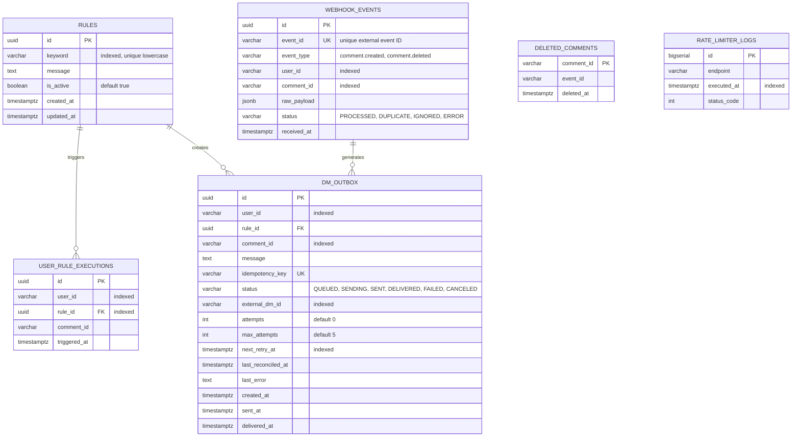
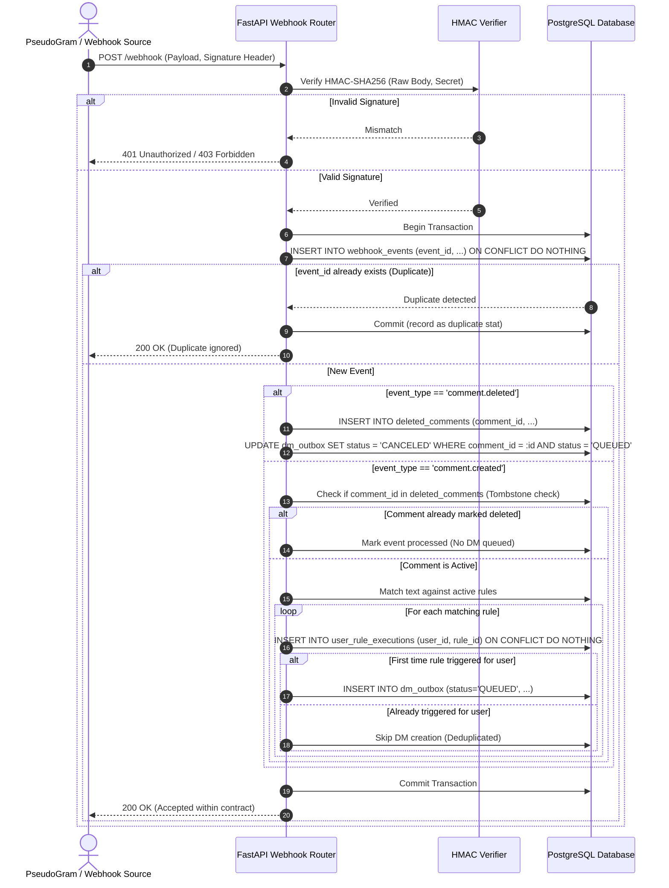
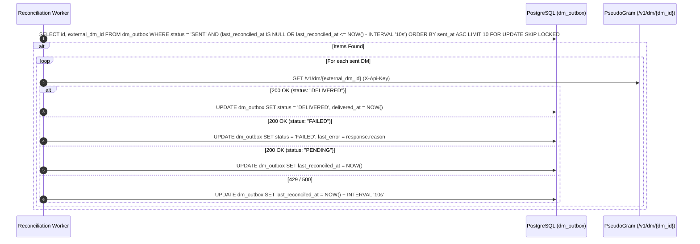

# LinkPlease System Architecture & Technical Design

## 1. Executive Summary

This document defines the complete technical architecture for the **LinkPlease Backend Application**. The service is built as a single, unified FastAPI application designed to handle high-throughput social webhook ingestion (handling bursts such as 500 comments in 10 seconds with HTTP 200 responses returned well within the 5-second webhook contract), deterministic keyword-based rule matching, deduplicated DM dispatch, reliable retry and reconciliation loops, and strict adherence to external downstream rate limits (maximum 10 requests per rolling 60 seconds for `POST /v1/dm/send` against PseudoGram API).

---

## 2. System Architecture Overview

```mermaid
flowchart TD
    subgraph External_Clients ["External Clients & PseudoGram Webhook"]
        A[Client / Admin] -->|POST /rules| B[FastAPI: Rules API]
        A -->|GET /stats| C[FastAPI: Stats API]
        P[PseudoGram Platform] -->|POST /webhook\nHMAC Signed| D[FastAPI: Webhook Ingestion API]
    end

    subgraph FastAPI_Application ["LinkPlease Backend Core"]
        D -->|Verify HMAC & Deduplicate| E[Webhook Ingestion Service]
        B --> F[(PostgreSQL: Rules)]
        E --> G[(PostgreSQL: Webhook Events & Tombstones)]
        E -->|Rule Match & Unique User Check| H[(PostgreSQL: DM Outbox / Queue)]
        
        subgraph Workers ["Async Background Workers"]
            W1[DM Dispatch Worker\nRate-Limited: <=10 sends/60s]
            W2[Delivery Reconciliation Worker\nStatus Polling (Unlimited)]
        end
    end

    subgraph External_PseudoGram ["PseudoGram Mock API"]
        W1 -->|POST /v1/dm/send\nwith Idempotency-Key| PG1[PseudoGram: DM Send (202 Accepted)]
        W2 -->|GET /v1/dm/{dm_id}| PG2[PseudoGram: DM Status Check]
    end

    H -.->|FOR UPDATE SKIP LOCKED| W1
    W1 -.->|Record external_dm_id| H
    H -.->|Query SENT DMs| W2
    W2 -.->|Update DELIVERED / FAILED| H
    C -->|Aggregate Counts & Status| G
    C -->|Aggregate Outbox Metrics| H
```

---

## 3. Core Requirements & Feature Matrix

The application integrates Part A, Part B, and Part C as unified layers within one cohesive codebase:

| Component / Requirement | Level | Implementation Strategy |
| :--- | :--- | :--- |
| **Rule Management (`POST /rules`)** | Part A | Persistent storage of keyword & message pairs, indexed case-insensitive lookups. |
| **Keyword Matching** | Part A | Case-insensitive substring and boundary token matching over incoming comment text. |
| **Duplicate Event Handling** | Part A | Idempotent event ingestion using `event_id` unique constraint in PostgreSQL. |
| **User/Rule Deduplication** | Part A | Database unique constraint `(user_id, rule_id)` preventing identical rule DMs to the same user. |
| **Reliable DM Sending** | Part A | Transactional Outbox pattern with `FOR UPDATE SKIP LOCKED` database queue. |
| **Retry Handling** | Part A | Exponential backoff with full jitter for 500s/network errors, 400 permanent failures. |
| **HMAC Signature Verification** | Part B | Constant-time HMAC-SHA256 verification of raw request payloads. |
| **Accurate `/stats` Under Load** | Part B | Real-time SQL aggregations and atomic state counters for zero-drift metrics. |
| **DM Delivery Reconciliation** | Part C | Periodic background polling of `GET /v1/dm/{dm_id}` for eventual status updates (does not consume send rate-limit budget). |
| **`comment.deleted` & Out-of-Order** | Part C | Tombstone table & immediate state cancellation for queued/in-flight DMs. |
| **High Concurrency (500 in 10s)** | Part C | Fast asynchronous non-blocking ingestion returning HTTP 200 well within the 5-second contract. |
| **Downstream DM Send Rate Limiter** | Part C | Strict sliding window / token bucket limiter ensuring $\le 10\text{ send requests}/60\text{s}$ to `POST /v1/dm/send`. |

---

## 4. Database Schema Design (PostgreSQL)



### Table Definitions & Key Constraints

1. **`rules`**:
   - `keyword`: Case-insensitive indexed column (`LOWER(keyword)` index or stored lowercased).
   - `message`: Response template or text to send.

2. **`webhook_events`**:
   - `event_id`: Unique index ensuring exact-once webhook recording.
   - `user_id`: Sender identity (`user_id` is the identity, not username).

3. **`user_rule_executions`**:
   - Unique composite constraint: `UNIQUE (user_id, rule_id)`.
   - Guaranteed DB-level deduplication: Even if concurrent webhooks arrive for the same user matching the same rule, only one insert succeeds.

4. **`deleted_comments` (Tombstone Table)**:
   - Stores `comment_id` when `comment.deleted` event is received.
   - Solves out-of-order arrival: If `comment.deleted` arrives before `comment.created`, the creation handler checks this table and skips DM creation.

5. **`dm_outbox` (Transactional Outbox & State Machine)**:
   - State transition: `QUEUED` $\rightarrow$ `SENDING` $\rightarrow$ `SENT` $\rightarrow$ `DELIVERED` (or `FAILED` / `CANCELED`).
   - `idempotency_key`: `dm_{user_id}_{rule_id}_{comment_id}` passed to PseudoGram header.
   - Partial composite index: `CREATE INDEX idx_outbox_fetch ON dm_outbox (status, next_retry_at) WHERE status IN ('QUEUED', 'SENDING');`

6. **`rate_limiter_logs`**:
   - Tracks timestamps of external `POST /v1/dm/send` calls to PseudoGram for rolling window validation and auditability.

---

## 5. Component Deep Dive & Processing Flows

### 5.1 Ingestion Flow (`POST /webhook`)

The webhook contract requires `POST /webhook` to return HTTP 200 within 5 seconds. To achieve this comfortably even under a burst of 500 requests in 10 seconds, ingestion performs fast in-memory validation and single-transaction DB staging, deferring external API calls entirely to background workers.



---

### 5.2 Outbox Dispatch Worker & Strict Send Rate Limiter ($\le 10\text{ sends}/60\text{s}$)

The PseudoGram API enforces a strict rate limit of **10 requests per rolling 60 seconds** specifically on `POST /v1/dm/send`. Read requests (`GET /v1/dm/{dm_id}`) do **not** count against this rate-limit budget.

```mermaid
flowchart TD
    Start[Worker Loop Tick] --> Lock[Acquire Token from DM Send Sliding Window Rate Limiter]
    Lock --> CheckRate{Tokens Available in Last 60s Window?}
    
    CheckRate -- No (<10 sends full) --> Wait[Sleep until earliest send slides out of 60s window]
    Wait --> Lock
    
    CheckRate -- Yes (Token acquired) --> FetchJob[Fetch next pending job:\nSELECT ... FROM dm_outbox\nWHERE status = 'QUEUED' AND next_retry_at <= NOW()\nORDER BY created_at ASC LIMIT 1\nFOR UPDATE SKIP LOCKED]
    
    FetchJob --> JobFound{Job Found?}
    JobFound -- No --> Idle[Sleep 500ms]
    
    JobFound -- Yes --> CheckTombstone{Comment Deleted?}
    CheckTombstone -- Yes --> Cancel[UPDATE dm_outbox SET status='CANCELED']
    
    CheckTombstone -- No --> SendHTTP[POST /v1/dm/send\nHeaders: X-Api-Key, Idempotency-Key\nBody: recipient_user_id, message, comment_id]
    
    SendHTTP --> EvalResponse{HTTP Response Status}
    
    EvalResponse -- 202 Accepted --> MarkSent[UPDATE dm_outbox SET\nstatus = 'SENT',\nexternal_dm_id = resp.dm_id,\nsent_at = NOW()]
    
    EvalResponse -- 400 Bad Request --> MarkFailed[UPDATE dm_outbox SET\nstatus = 'FAILED',\nlast_error = resp.detail\n(Non-retryable)]
    
    EvalResponse -- 429 Rate Limit --> Handle429[Read Retry-After header\nPause Rate Limiter\nUPDATE dm_outbox SET\nnext_retry_at = NOW() + retry_after]
    
    EvalResponse -- 500 / Network Error --> Handle500[Calculate Exponential Backoff + Jitter\nUPDATE dm_outbox SET\nattempts = attempts + 1,\nnext_retry_at = NOW() + backoff]
```

#### Rate Limiter Algorithm: Dedicated Send Sliding Window Log

To ensure 100% compliance on outbound direct messages:
1. **Endpoint-Specific Scope**: The rate limit ($\le 10\text{ requests} / 60\text{s}$) applies **strictly and exclusively** to `POST /v1/dm/send`. Read requests (`GET /v1/dm/{dm_id}`) do **not** consume this rate-limit budget and are unrestricted.
2. **Durable Database Persistence**: Rate-limit reservations are durably recorded in PostgreSQL table `rate_limit_logs` (`endpoint="POST /v1/dm/send"`, `sent_at`, `dm_outbox_id`). Rate-limit state survives worker/application restarts without relying on in-memory counters.
3. **Multi-Worker Concurrency Protection via Advisory Locks**: In production PostgreSQL, transaction-level advisory locking (`SELECT pg_advisory_xact_lock(74291837)`) serializes the atomic **`CHECK -> RESERVE -> COMMIT`** operation across concurrent worker processes, eliminating race conditions (e.g. two workers seeing 9 reservations and both inserting, which would result in 11).
4. **All Outbound Attempts Consume Budget**: Rate-limit slots are acquired immediately before outbound HTTP transmission. Consequently, all responses and failure modes (HTTP 202, HTTP 400, HTTP 429, HTTP 500, network timeouts, connection drops) consume 1 rate-limit reservation and slots are never refunded.
5. **Retries vs. Idempotency Keys**: Each retry of a failed or rate-limited DM is a distinct outbound HTTP request and therefore acquires a **new** rate-limit reservation in `rate_limit_logs`. However, all retries of the same delivery must reuse the exact same `DMOutbox.idempotency_key`.
6. **Deterministic Sliding Window & Wait Calculation**:
   $$\text{Active Window Send Count} = \text{Count}(\text{reservations where } t > \text{now} - 60.0\text{s})$$
   If $\text{Active Window Send Count} \ge 10$:
   $$\text{Wait Duration} = 60.0\text{s} - (\text{now} - t_{\text{oldest\_send\_in\_window}}) + \text{safety buffer (0.05s)}$$
   The transaction and advisory lock are committed and released immediately before sleeping so database connections are never held while waiting.
7. **Testing Note**: While SQLite is utilized for fast localized unit test execution, SQLite tests do not prove PostgreSQL multi-process advisory lock concurrency safety. Production safety is verified via dedicated PostgreSQL advisory lock validation.

---

### 5.3 DM Delivery Reconciliation Worker (Part C)

Since `POST /v1/dm/send` returns `202 Accepted`, PseudoGram processes message delivery asynchronously. LinkPlease reconciles actual delivery state via `GET /v1/dm/{dm_id}` (which is unconstrained by the send rate-limit budget):



---

## 6. Edge Cases, Race Conditions & Failure Scenarios Analysis

| Scenario / Edge Case | Risk | Architectural Mitigation |
| :--- | :--- | :--- |
| **1. Burst Webhooks (500 in 10s)** | Webhook timeouts, thread exhaustion, breach of 5s contract. | Ingestion handler executes non-blocking asynchronous DB transactions (`asyncpg` pool); returns HTTP 200 quickly while queueing jobs in DB outbox. |
| **2. Duplicate `event_id` Webhooks** | Duplicate rule triggering, double DM sending. | `webhook_events.event_id` carries a unique DB index. Duplicate insertions are caught via `ON CONFLICT DO NOTHING`, returning `200 OK` immediately. |
| **3. Concurrent Webhooks for Same User** | Two comments from the same user match the same rule within milliseconds; both try to queue a DM. | `user_rule_executions` has a unique constraint on `(user_id, rule_id)`. The first transaction succeeds; the concurrent transaction triggers conflict and skips outbox insertion. |
| **4. Out-of-Order: `comment.deleted` before `comment.created`** | `comment.created` arrives second and mistakenly queues a DM for a deleted comment. | `deleted_comments` tombstone table records the deletion first. When `comment.created` arrives, it verifies against `deleted_comments` and aborts DM generation. |
| **5. `comment.deleted` arrives while DM is QUEUED** | A DM is queued but not yet sent to PseudoGram. | `comment.deleted` execution updates all `QUEUED` records in `dm_outbox` matching `comment_id` directly to `CANCELED`. |
| **6. Downstream 500 / Network Drop** | Dropped DMs, unhandled state. | Transactional outbox retains `QUEUED` status; applies exponential backoff ($2^{\text{attempt}} + \text{jitter}$) up to `max_attempts=5`. |
| **7. Downstream 429 Rate Limit** | Cascading rate-limit penalties from PseudoGram. | Worker catches 429, extracts `Retry-After`, and pauses the send rate limiter for the specified duration. |
| **8. PseudoGram 400 Bad Request** | Infinite retry loop on invalid user or malformed payload. | 400 responses are classified as non-retryable fatal errors; outbox record is immediately marked `FAILED`. |
| **9. Network Timeout on `POST /v1/dm/send`** | Request sent by LinkPlease, received by PseudoGram, but response lost in transit. | Deterministic `Idempotency-Key` header (`dm_{outbox_id}`) sent on all calls. On retry, PseudoGram returns the existing `dm_id` without duplicate delivery. |
| **10. Server Crash / Worker Restart** | In-flight jobs lost in memory. | Zero in-memory job queues; all jobs are persisted in PostgreSQL. Upon server restart, workers resume `QUEUED` and `SENDING` jobs seamlessly. |

---

## 7. Metrics & Accurate `/stats` Architecture

The `GET /stats` endpoint provides consistent metrics without drifting counters under load. Metrics are derived from clean database aggregations:

```json
{
  "events": {
    "total_received": 520,
    "unique_processed": 500,
    "duplicates_ignored": 20,
    "comments_created": 490,
    "comments_deleted": 10
  },
  "rules": {
    "active_rules": 3,
    "rules_triggered": 450
  },
  "dms": {
    "queued": 120,
    "sending": 1,
    "sent_awaiting_reconciliation": 150,
    "delivered": 170,
    "failed": 2,
    "canceled": 7,
    "total_dispatched": 322
  },
  "rate_limiter": {
    "sends_last_60s": 10,
    "send_limit": 10,
    "tokens_available": 0,
    "retry_after_seconds": 4.2
  }
}
```

---

## 8. Proposed Project Structure

```
linkplease/
├── .env.example                  # Environment variables template
├── .gitignore                    # Python, PostgreSQL, IDE ignore rules
├── README.md                     # Setup instructions & API usage guide
├── ARCHITECTURE.md               # Complete architecture & design document
├── requirements.txt              # Production & development dependencies
├── pytest.ini                    # Pytest configuration
│
├── app/
│   ├── __init__.py
│   ├── main.py                   # FastAPI app entry point & lifespan manager
│   ├── config.py                 # Pydantic BaseSettings (DB URL, API keys, secrets)
│   ├── database.py               # Async SQLAlchemy engine, session maker, base model
│   │
│   ├── models/                   # SQLAlchemy ORM Data Models
│   │   └── __init__.py
│   │
│   ├── schemas/                  # Pydantic Request/Response Schemas
│   │   └── __init__.py
│   │
│   ├── api/                      # FastAPI Route Handlers
│   │   └── __init__.py
│   │
│   ├── core/                     # Core Security & Rate Limiting Infrastructure
│   │   └── __init__.py
│   │
│   ├── services/                 # Domain Business Logic
│   │   └── __init__.py
│   │
│   └── workers/                  # Background Worker Tasks (Lifespan managed)
│       └── __init__.py
│
└── tests/                        # Comprehensive Test Suite (pytest + httpx)
    ├── __init__.py
    └── conftest.py
```

---

## 9. Testing Strategy

1. **Unit Tests**:
   - Keyword matching algorithm: case insensitivity, boundary tokens, multi-word keywords.
   - HMAC signature generator & validator with valid, invalid, and missing signatures.
   - Exponential backoff calculation and jitter bounds.

2. **Integration Tests**:
   - `POST /rules`: Rule creation and validation.
   - `POST /webhook`: Ingestion of `comment.created` and `comment.deleted`, duplicate `event_id` discard, `(user_id, rule_id)` deduplication.
   - `GET /stats`: Verification of exact counters before, during, and after processing.

3. **Concurrency & Load Tests (Part C)**:
   - High-throughput ingestion: Simulated burst of 500 webhook calls in 10 seconds verifying HTTP 200 responses well within 5 seconds.
   - Rate limit verification: Mock PseudoGram endpoint verifying that in no rolling 60-second window are $>10$ DM send calls dispatched.
   - Out-of-order events: Sending `comment.deleted` before `comment.created` to verify zero DMs sent.
